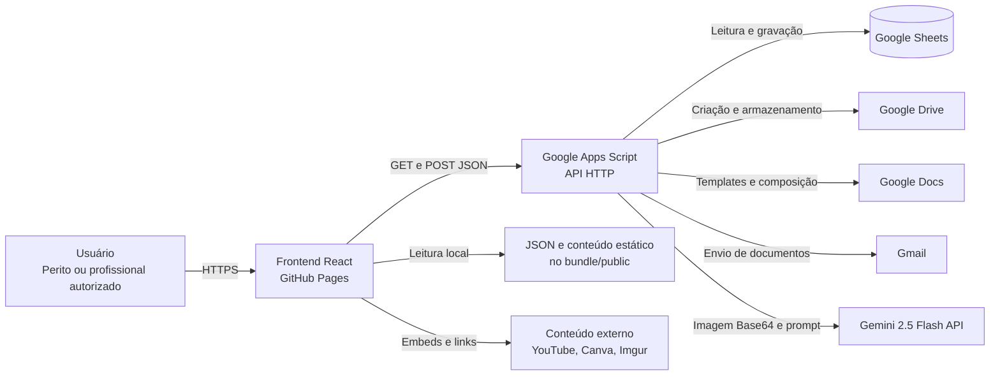
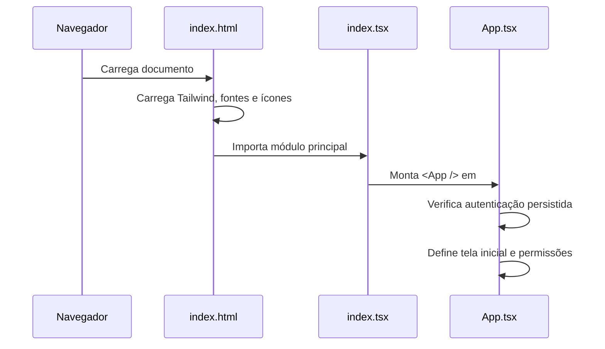
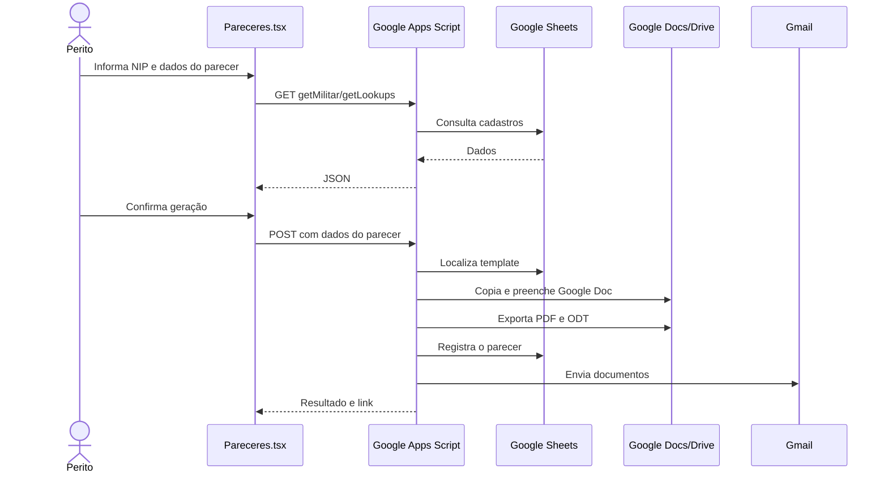
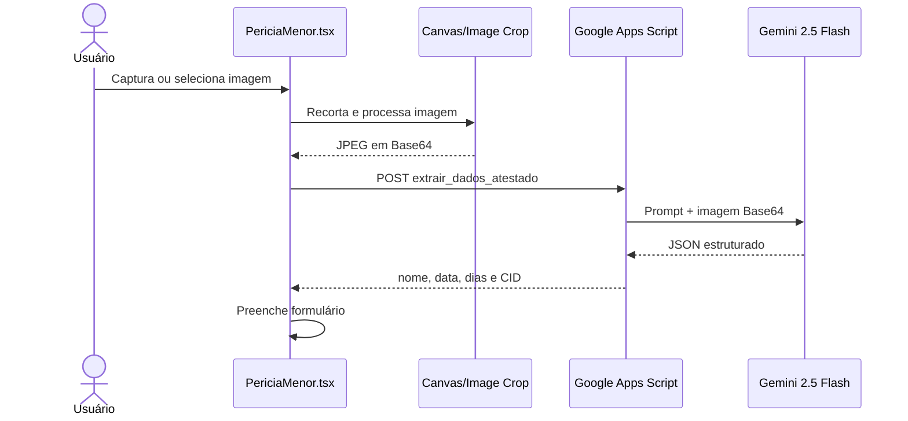
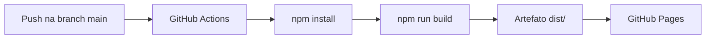
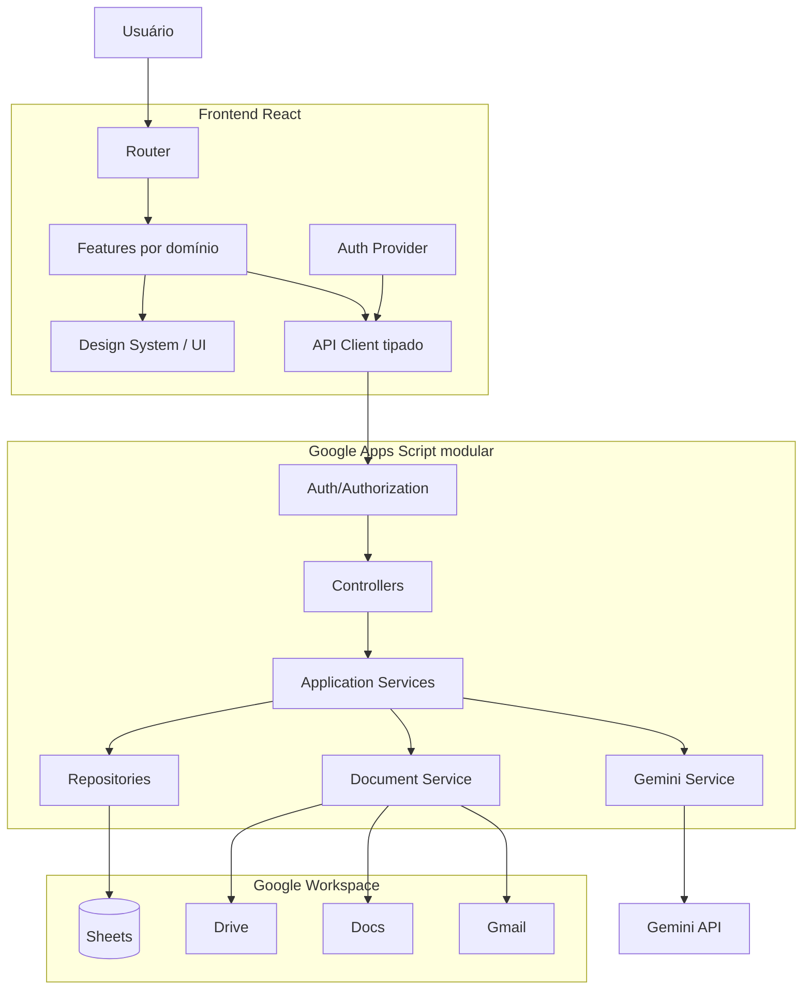

# Arquitetura do Sistema

## 1. Visão geral

O **Guia Médico Naval — JRS/HNRe** é uma aplicação web responsiva, de página única (*Single Page Application* — SPA), voltada ao apoio das atividades médico-periciais da Junta Regular de Saúde do Hospital Naval de Recife.

A solução combina quatro grupos principais de capacidades:

1. **Consulta de conteúdo normativo e médico-pericial**, armazenado majoritariamente no próprio código-fonte.
2. **Formulários operacionais**, como geração de pareceres e perícias menores.
3. **Automação documental**, executada por Google Apps Script com Google Sheets, Google Docs, Google Drive e Gmail.
4. **Extração assistida por IA**, utilizando o modelo Gemini 2.5 Flash no backend para interpretar imagens de atestados.

A arquitetura atual privilegia simplicidade de implantação e baixo custo operacional. O frontend é publicado como site estático no GitHub Pages, enquanto o backend é disponibilizado como Web App do Google Apps Script.

> **Constatação:** apesar de o `README.md` classificar o projeto como PWA, não foram identificados no repositório manifesto web, *service worker* ou estratégia de cache offline. Tecnicamente, a implementação observada é uma SPA responsiva e instalável apenas de forma limitada pelo navegador, não uma PWA completa.

---

## 2. Diagrama de contexto



---

## 3. Estilo arquitetural

### 3.1 Frontend

O frontend segue uma arquitetura de SPA baseada em componentes React. A troca de telas ocorre por estado interno no componente `App.tsx`, sem React Router e sem alteração da URL do navegador.

Características observadas:

- React 19 com TypeScript;
- Vite como ferramenta de desenvolvimento e *build*;
- componentes funcionais e Hooks;
- estado predominantemente local com `useState` e `useEffect`;
- ausência de gerenciador de estado global;
- ausência de camada formal de rotas;
- estilos utilitários Tailwind carregados por CDN;
- uso complementar de Material Symbols e Lucide React;
- conteúdo médico e normativo embutido em componentes e em `constants.ts`;
- dados auxiliares estáticos em `public/*.json`.

### 3.2 Backend

O backend é um monólito serverless implementado em um único arquivo `Code.gs`. Ele expõe uma API HTTP por meio das funções padrão do Google Apps Script:

- `doGet(e)` para consultas e operações parametrizadas;
- `doPost(e)` para criação de documentos, processamento de imagens e outras operações com corpo JSON.

O Google Apps Script atua simultaneamente como:

- controlador HTTP;
- camada de aplicação;
- camada de acesso a dados;
- orquestrador de documentos;
- cliente da API Gemini;
- cliente dos serviços Google Workspace.

### 3.3 Persistência

Não há banco de dados dedicado. A persistência operacional utiliza Google Sheets, com abas funcionando como tabelas lógicas. Os identificadores das planilhas e da pasta principal do Drive estão definidos no início de `Code.gs`.

### 3.4 Integrações

A aplicação integra-se diretamente com:

- Google Apps Script Web App;
- Google Sheets;
- Google Docs;
- Google Drive;
- Gmail;
- Gemini API;
- Firebase Authentication, embora essa integração não esteja conectada ao fluxo principal de autenticação observado;
- provedores de mídia externa, como YouTube, Canva e Imgur.

---

## 4. Componentes de alto nível

| Componente | Responsabilidade | Tecnologia |
|---|---|---|
| `index.html` | Documento HTML base, fontes, Tailwind CDN, import map e montagem da aplicação | HTML |
| `index.tsx` | Ponto de entrada e montagem do React | React DOM |
| `App.tsx` | Shell da aplicação, autenticação local, navegação e controle de acesso por perfil | React + TypeScript |
| `components/` | Telas, módulos funcionais e conteúdo da aplicação | React + TypeScript |
| `components/sections/` | Seções especializadas do guia de doenças | React + TypeScript |
| `services/extrasService.ts` | Consulta e normalização de conteúdos extras | TypeScript + Fetch API |
| `services/firebaseAuth.ts` | Autenticação Google via Firebase e obtenção de token do Drive | Firebase SDK |
| `constants.ts` | Conteúdo estático e dados estruturados | TypeScript |
| `public/*.json` | Catálogos estáticos carregados em tempo de execução | JSON |
| `Code.gs` | API, regras de negócio, persistência e automação documental | Google Apps Script |
| GitHub Actions | Compilação e publicação do frontend | GitHub Pages |

---

## 5. Organização do repositório

```text
/
├── .github/
│   └── workflows/
│       └── deploy.yml
├── components/
│   ├── sections/
│   ├── Artigos.tsx
│   ├── CasosPericiais.tsx
│   ├── ConcursosGuide.tsx
│   ├── DGPM406Guide.tsx
│   ├── DiseaseGuide.tsx
│   ├── Estudo.tsx
│   ├── ExamesGuide.tsx
│   ├── HNReGuide.tsx
│   ├── Login.tsx
│   ├── Mensagens.tsx
│   ├── Pareceres.tsx
│   ├── PericiaMenor.tsx
│   ├── TemplatesGuide.tsx
│   └── ...
├── public/
│   ├── cid.json
│   └── servicosHNRe.json
├── services/
│   ├── extrasService.ts
│   └── firebaseAuth.ts
├── App.tsx
├── Code.gs
├── constants.ts
├── firebase-applet-config.json
├── index.html
├── index.tsx
├── package.json
├── tsconfig.json
├── types.ts
└── vite.config.ts
```

### 5.1 Observação sobre a estrutura atual

A organização é funcional para o porte atual, mas mistura três categorias dentro de `components/`:

- componentes de layout;
- telas completas;
- conteúdo editorial estático.

Com o crescimento do projeto, essa estrutura tende a aumentar o acoplamento e dificultar a localização de regras específicas.

---

## 6. Arquitetura do frontend

### 6.1 Inicialização

O fluxo de inicialização é:



O `index.tsx` utiliza `React.StrictMode` e monta o componente principal no elemento `#root`.

### 6.2 Navegação

A navegação é controlada pela propriedade de estado:

```ts
const [currentView, setCurrentView] = useState<NavItem>('splash');
```

O tipo `NavItem`, definido em `types.ts`, enumera todas as telas possíveis. O método interno de renderização em `App.tsx` usa um `switch` para escolher o componente correspondente.

#### Consequências desse modelo

**Vantagens:**

- implementação simples;
- nenhuma dependência adicional;
- transições imediatas entre telas;
- adequada a uma aplicação pequena e fechada.

**Limitações:**

- não há URL exclusiva por tela;
- atualizar o navegador pode perder o contexto de navegação;
- o botão Voltar do navegador não representa a navegação interna;
- não há *deep linking*;
- todas as telas importadas diretamente tendem a integrar o mesmo bundle inicial;
- o crescimento do `App.tsx` aumenta a complexidade do shell.

### 6.3 Estado

O projeto não utiliza Context API, Redux, Zustand ou outra solução de estado global. O estado fica distribuído entre:

- `App.tsx`, para usuário autenticado, tela atual, menus e contadores;
- componentes de tela, para formulários, listas, modais e estados assíncronos;
- `localStorage`, para persistência da sessão personalizada.

### 6.4 Camada de serviços

Há uma camada de serviços parcial:

- `extrasService.ts` centraliza a busca e normalização dos conteúdos extras;
- `firebaseAuth.ts` encapsula Firebase Authentication.

Entretanto, a maior parte das chamadas HTTP ao Google Apps Script está declarada diretamente nos componentes, com repetição da constante `GAS_URL` e tratamento individual de respostas.

### 6.5 Conteúdo e dados locais

O frontend usa três formas de dados locais:

1. objetos TypeScript em `constants.ts`;
2. conteúdo textual diretamente nos componentes;
3. arquivos JSON em `public/`.

Os arquivos observados em `public/` são:

- `cid.json`: catálogo de códigos CID;
- `servicosHNRe.json`: catálogo de serviços do HNRe.

O componente `PericiaMenor.tsx` resolve esses arquivos com base no caminho público configurado pelo Vite.

### 6.6 Geração local de documentos

O componente `DiseaseGuide.tsx` utiliza `jsPDF` para geração de PDF no navegador. O componente `CasosPericiais.tsx` cria uma janela HTML temporária e aciona a impressão do navegador.

Esses fluxos são independentes da geração documental feita no backend.

---

## 7. Módulos funcionais

### 7.1 Benefícios e doenças previstas em lei

Componentes principais:

- `DiseaseGuide.tsx`;
- `FinalidadesGuide.tsx`;
- `PortariaGuide.tsx`;
- `LawReference.tsx`;
- `components/sections/*`.

Responsabilidades:

- consulta a patologias e critérios;
- apresentação de documentação necessária;
- navegação entre referências normativas;
- ferramentas clínicas auxiliares;
- exportação local de conteúdo em PDF.

A maior parte dos dados deste domínio é estática e compilada junto ao frontend.

### 7.2 Avaliações e exames

Componentes principais:

- `ConcursosGuide.tsx`;
- `ExamesGuide.tsx`;
- `DGPM406AnexosGuide.tsx`.

Responsabilidades:

- apresentar critérios incapacitantes;
- filtrar exames por finalidade;
- organizar conteúdo da DGPM-406 e anexos.

### 7.3 Pareceres

Componente principal:

- `Pareceres.tsx`.

Dependências externas:

- Google Apps Script;
- Google Sheets;
- Google Docs;
- Google Drive;
- Gmail.

Fluxo resumido:



### 7.4 Perícia menor

Componentes principais:

- `PericiaMenor.tsx`;
- `PericiaMenorDetalhe.tsx`.

Responsabilidades:

- captura ou envio de imagem de atestado;
- recorte e processamento da imagem com `react-image-crop` e Canvas;
- extração estruturada de dados com Gemini;
- pesquisa do militar por NIP ou nome;
- consulta aos catálogos CID e serviços;
- geração do documento final;
- listagem de perícias vigentes e concluídas.

Fluxo de leitura do atestado:



### 7.5 Mensagens

Componente principal:

- `Mensagens.tsx`.

O módulo envia uma requisição `POST` ao mesmo backend GAS. No backend, a IA é utilizada para produzir ou estruturar minutas a partir dos dados recebidos, conforme as ações implementadas em `Code.gs`.

### 7.6 Conteúdo educacional e extras

Componentes principais:

- `Estudo.tsx`;
- `Aulas.tsx`;
- `Videos.tsx`;
- `Infograficos.tsx`;
- `Resumos.tsx`;
- `RoteiroJRS.tsx`;
- `Artigos.tsx` e páginas de artigos.

A função `fetchExtras()` consulta uma planilha via Google Apps Script e normaliza os formatos de mídia. A camada de apresentação reconhece principalmente:

- vídeos do YouTube;
- apresentações e materiais do Canva;
- imagens e infográficos;
- links externos.

---

## 8. Arquitetura do backend Google Apps Script

### 8.1 Estrutura

O arquivo `Code.gs` contém:

- constantes com IDs de recursos;
- `doGet(e)`;
- funções auxiliares;
- `doPost(e)`;
- regras de geração e envio de documentos.

A seleção da operação é feita por um campo `action` recebido por query string ou no corpo JSON.

### 8.2 Operações GET observadas

Entre as operações implementadas ou consumidas pelo frontend estão:

| Ação | Finalidade |
|---|---|
| `login` | Validar credenciais do usuário |
| `getUsuarios` | Consultar usuários cadastrados |
| `createUsuario` | Criar solicitação ou registro de usuário |
| `getLookups` | Obter finalidades, postos, quadros, especialidades, dispensas, OM e peritos |
| `getMilitar` | Consultar um militar por NIP |
| `getMilitaresList` | Listar militares para busca/autocomplete |
| `getPareceresList` | Listar pareceres gerados |
| `getPericiaMenorList` | Listar perícias menores e calcular vigência |
| `getTemplatesDocumentos` | Obter metadados de templates |
| `getExtras` | Obter materiais extras de outra planilha |

> Algumas ações aparecem no consumo do frontend e outras no backend. A tabela consolida o contrato observado entre ambos.

### 8.3 Operações POST observadas

| Ação | Finalidade |
|---|---|
| `extrair_dados_atestado` | Enviar imagem ao Gemini e obter dados estruturados |
| geração de perícia menor | Criar documento, anexar imagem, exportar e registrar |
| geração de parecer | Copiar template, substituir marcadores, exportar e registrar |
| `imprimir` | Executar ação associada ao PDF gerado |
| geração de mensagem/minuta | Processar dados com Gemini e retornar texto estruturado |

### 8.4 Google Sheets como banco operacional

O backend utiliza abas de planilha como tabelas. Foram identificadas referências a:

- `ListasRef`;
- `OM`;
- `Perito`;
- `Militares`;
- `Templates_Documentos`;
- `Pareceres`;
- `Pericia_Menor`;
- abas relacionadas a usuários e templates adicionais.

A leitura é feita por `getDataRange().getValues()`, seguida por transformação manual de linhas e colunas.

### 8.5 Automação documental

O padrão de geração documental é:

1. localizar o template por tipo ou especialidade;
2. copiar o arquivo para uma pasta de destino;
3. abrir a cópia com `DocumentApp`;
4. substituir marcadores como `{{INSPECIONADO}}` e `{{FINALIDADE}}`;
5. inserir conteúdo e, quando aplicável, imagem;
6. salvar o documento;
7. exportar para PDF e/ou ODT;
8. registrar o resultado em planilha;
9. enviar por e-mail;
10. mover a cópia temporária do Google Docs para a lixeira.

### 8.6 Integração com Gemini

A chave da API Gemini é recuperada por:

```js
PropertiesService.getScriptProperties().getProperty("GEMINI_API_KEY")
```

Isso mantém a chave fora do frontend no fluxo observado de OCR. O backend envia à API:

- prompt textual;
- imagem JPEG em Base64;
- configuração de resposta JSON.

O modelo observado é:

```text
gemini-2.5-flash
```

---

## 9. Autenticação e autorização

### 9.1 Fluxo principal observado

A autenticação utilizada pelo `App.tsx` e por `Login.tsx` é personalizada e delegada ao Google Apps Script.

O frontend envia:

- usuário;
- hash da senha.

Após autenticação bem-sucedida, armazena em `localStorage`:

```json
{
  "usuario": "...",
  "senhaHash": "..."
}
```

Na próxima inicialização, o frontend reutiliza essas informações para validar novamente a sessão no backend.

### 9.2 Perfis

O shell reconhece três perfis:

| Perfil | Acesso observado |
|---|---|
| `admin` | Acesso amplo, incluindo mensagens e recursos administrativos |
| `hnre` | Acesso a documentos e conteúdos internos do HNRe |
| `user` | Acesso reduzido, principalmente consulta geral |

A visibilidade dos itens da navegação é controlada no frontend por condicionais baseadas em `authUser.perfil`.

### 9.3 Firebase Authentication

O arquivo `services/firebaseAuth.ts` implementa:

- login Google por popup;
- escopo de leitura do Google Drive;
- acompanhamento do estado de autenticação;
- cache de token em memória;
- logout.

Entretanto, não foi identificada integração ativa desse serviço com `App.tsx` ou `Login.tsx`. Portanto, ele aparenta ser código experimental, legado ou preparado para uma migração futura.

### 9.4 Limites de segurança da implementação atual

Os controles de perfil no frontend não devem ser considerados autorização suficiente. Toda operação sensível precisa ser validada novamente no backend.

Pontos de atenção observados:

- hash de senha persistido no `localStorage`;
- credenciais transmitidas por query string em operações GET;
- URLs do backend repetidas e expostas no bundle;
- identificadores de planilhas e pastas declarados no código do Apps Script;
- controle de visibilidade implementado no cliente;
- ausência aparente de token de sessão assinado e expirável;
- possível coexistência de dois modelos de autenticação.

---

## 10. Contratos de dados

### 10.1 Tipos centrais do frontend

`types.ts` define:

- `NavItem`;
- `Diagnosis`;
- `Disease`;
- `Law`.

Outros contratos são definidos localmente dentro dos componentes e serviços, como `AuthUser` e `ExtraItem`.

### 10.2 Formato padrão das respostas do GAS

O backend tende a retornar o seguinte envelope:

```json
{
  "success": true,
  "data": {}
}
```

Em caso de erro:

```json
{
  "success": false,
  "message": "Descrição do erro"
}
```

Não existe, no repositório, uma definição compartilhada ou esquema formal para esses contratos.

### 10.3 Validação

A validação ocorre de forma manual no frontend e no backend. Não foram identificadas bibliotecas de schema, como Zod, Yup ou JSON Schema.

---

## 11. Implantação

### 11.1 Frontend

O frontend é compilado pelo Vite e publicado no GitHub Pages por `.github/workflows/deploy.yml`.

Fluxo:



Configurações relevantes:

- Node.js 20 no CI;
- base pública do Vite: `/DoencasEPareceresJRS/`;
- artefato publicado: `dist/`;
- implantação acionada em `push` para `main`.

### 11.2 Backend

O backend precisa ser publicado separadamente como Web App do Google Apps Script. O repositório não contém automação de deploy do `Code.gs` por `clasp` ou GitHub Actions.

Consequentemente, frontend e backend possuem ciclos de publicação independentes.

### 11.3 Configuração de ambiente

O `vite.config.ts` lê `GEMINI_API_KEY` e a injeta como `process.env`, mas não foi identificada utilização dessa chave no frontend analisado. A extração de atestados usa a chave armazenada nas propriedades do Apps Script.

A configuração Firebase está no arquivo:

```text
firebase-applet-config.json
```

As configurações públicas de cliente Firebase não são segredos, mas as regras do projeto Firebase devem restringir adequadamente os recursos associados.

---

## 12. Dependências externas

### 12.1 Dependências de produção

| Pacote | Uso observado |
|---|---|
| `react` | Interface e composição de componentes |
| `react-dom` | Montagem da aplicação |
| `firebase` | Autenticação Google preparada em serviço separado |
| `jspdf` | Geração local de PDFs |
| `lucide-react` | Ícones |
| `react-image-crop` | Recorte de imagem de atestado |

### 12.2 Dependências carregadas externamente

O `index.html` carrega por CDN:

- Tailwind CSS;
- Google Fonts;
- Google Material Symbols;
- módulos via `esm.sh` em um `importmap`.

O uso simultâneo de dependências NPM e `importmap` é redundante no contexto de uma aplicação Vite e pode dificultar a previsibilidade das versões realmente utilizadas.

### 12.3 Serviços externos

- Google Apps Script;
- Google Sheets;
- Google Drive;
- Google Docs;
- Gmail;
- Gemini API;
- Firebase;
- GitHub Pages;
- YouTube;
- Canva;
- Imgur;
- Google Fonts.

---

## 13. Qualidades arquiteturais

### 13.1 Pontos fortes

- **Baixo custo de infraestrutura:** GitHub Pages e Google Apps Script reduzem a necessidade de servidores dedicados.
- **Integração nativa com Google Workspace:** adequada ao fluxo documental existente.
- **Separação operacional básica:** frontend estático e backend serverless possuem responsabilidades distintas.
- **Mobile-first:** apropriado ao uso em ambiente assistencial e pericial.
- **Conteúdo local resiliente:** parte relevante da consulta funciona sem depender de banco remoto após o carregamento da aplicação.
- **Automação de documentos:** reduz trabalho manual e padroniza saídas.
- **Chave Gemini no backend:** evita exposição direta da chave usada no OCR.

### 13.2 Limitações

- `App.tsx` concentra navegação, autorização visual e shell da aplicação;
- backend monolítico em um único `Code.gs`;
- forte acoplamento ao layout e aos nomes das colunas das planilhas;
- URLs e identificadores repetidos ou fixos no código;
- inexistência de testes automatizados;
- ausência de validação de schemas;
- ausência de observabilidade estruturada;
- autenticação personalizada com riscos de sessão;
- ausência de roteamento por URL;
- ausência de *code splitting* explícito;
- contratos de API implícitos;
- componentes extensos com regras de UI, negócio e integração combinadas;
- Tailwind executado por CDN em produção;
- ausência de manifesto e *service worker* para caracterização como PWA completa.

---

## 14. Riscos técnicos

| Risco | Impacto | Probabilidade | Mitigação recomendada |
|---|---|---:|---|
| Alteração de colunas ou nomes de abas nas planilhas | Alto | Média | Criar repositórios de dados e validação explícita de cabeçalhos |
| Persistência do hash da senha no navegador | Alto | Alta | Substituir por sessão/token com expiração |
| Autorização apenas por ocultação de UI | Alto | Média | Validar perfil no backend em todas as ações sensíveis |
| Crescimento do `Code.gs` monolítico | Médio/Alto | Alta | Dividir em módulos `.gs` por domínio |
| Contratos frontend/backend não tipados | Médio | Alta | Definir DTOs e schemas compartilhados |
| Falha ou limite de cota do Apps Script | Alto | Média | Tratamento de retries, filas e monitoramento |
| Dependência de IDs fixos | Médio | Média | Centralizar configuração em Script Properties |
| Dependências por CDN | Médio | Média | Instalar e empacotar no build Vite |
| Bundle crescente | Médio | Média | React Router e lazy loading por rota |
| Ausência de testes | Alto | Alta | Adicionar testes unitários, integração e E2E |
| Dados médico-administrativos em serviços externos | Alto | Média | Revisar LGPD, acesso, retenção e auditoria |

---

## 15. Recomendações de evolução

### 15.1 Prioridade crítica: autenticação e autorização

1. Escolher um único mecanismo de autenticação.
2. Preferir Firebase Authentication, Google Identity ou sessão emitida pelo backend.
3. Eliminar o armazenamento de hash de senha no `localStorage`.
4. Não transmitir credenciais por query string.
5. Validar perfil e permissão em cada ação do Apps Script.
6. Registrar tentativas de acesso e operações sensíveis.

### 15.2 Centralizar a API do frontend

Criar uma estrutura semelhante a:

```text
src/
└── services/
    ├── apiClient.ts
    ├── authService.ts
    ├── pareceresService.ts
    ├── periciaMenorService.ts
    └── extrasService.ts
```

O `apiClient.ts` deve centralizar:

- URL base;
- serialização;
- tratamento de erro;
- timeout;
- autenticação;
- envelope padrão de resposta.

### 15.3 Adotar roteamento real

Introduzir React Router com URLs estáveis, por exemplo:

```text
/doencas
/concursos
/exames
/pareceres
/pericia-menor
/normas/dgpm-406
/normas/hnre
/estudo
```

Benefícios:

- histórico do navegador;
- links diretos;
- atualização sem perda de contexto;
- carregamento sob demanda;
- melhor organização de permissões.

### 15.4 Reorganizar o frontend por domínio

Estrutura recomendada:

```text
src/
├── app/
│   ├── App.tsx
│   ├── router.tsx
│   └── providers.tsx
├── components/
│   ├── ui/
│   └── layout/
├── features/
│   ├── auth/
│   ├── beneficios/
│   ├── concursos/
│   ├── pareceres/
│   ├── pericia-menor/
│   ├── normas/
│   └── estudo/
├── services/
├── data/
├── types/
└── styles/
```

### 15.5 Modularizar o Apps Script

Sugestão de divisão:

```text
apps-script/
├── Main.gs
├── Config.gs
├── AuthController.gs
├── ParecerController.gs
├── PericiaMenorController.gs
├── MensagemController.gs
├── MilitarRepository.gs
├── LookupRepository.gs
├── DocumentService.gs
├── GeminiService.gs
├── MailService.gs
└── ResponseUtils.gs
```

No Google Apps Script, vários arquivos `.gs` pertencentes ao mesmo projeto são carregados no mesmo escopo, permitindo modularização sem alterar a plataforma.

### 15.6 Formalizar contratos

Definir DTOs para todas as operações:

```ts
interface ApiResponse<T> {
  success: boolean;
  data?: T;
  message?: string;
  code?: string;
}
```

Também é recomendável validar entradas e saídas com schemas.

### 15.7 Configuração

Mover para configuração central:

- URL do Apps Script;
- IDs de planilhas;
- IDs de pastas;
- IDs de templates;
- nomes de abas;
- modelo Gemini;
- e-mails de destino;
- flags de ambiente.

No Apps Script, preferir `PropertiesService`. No frontend, usar variáveis `VITE_*` quando apropriado.

### 15.8 Testes

Adicionar:

- Vitest para unidades frontend;
- React Testing Library para componentes;
- Playwright para fluxos críticos;
- funções puras testáveis para transformação de dados do GAS;
- ambiente de homologação com planilha e pasta separadas.

Fluxos prioritários para E2E:

1. login;
2. consulta de militar;
3. geração de parecer;
4. OCR de atestado;
5. geração de perícia menor;
6. controle de acesso por perfil.

### 15.9 Observabilidade

Implementar:

- logs estruturados por ação;
- identificador de correlação por requisição;
- registro de usuário, horário e resultado;
- mensagens de erro sem dados sensíveis;
- painel ou planilha de auditoria;
- alertas para falhas na geração de documentos e chamadas Gemini.

### 15.10 PWA real, caso seja um requisito

Adicionar:

- `manifest.webmanifest`;
- ícones locais em múltiplas resoluções;
- *service worker*;
- estratégia de atualização;
- cache apenas de conteúdo público e estático;
- exclusão explícita de respostas autenticadas e dados sensíveis do cache.

---

## 16. Arquitetura-alvo sugerida



### Princípios da arquitetura-alvo

- organização por domínio;
- autorização no servidor;
- contratos tipados;
- configuração externa;
- baixo acoplamento entre UI e API;
- serviços backend especializados;
- rastreabilidade de operações;
- testes dos fluxos críticos;
- preservação da integração com Google Workspace.

---

## 17. Decisões arquiteturais registradas

### ADR-001 — Frontend estático no GitHub Pages

**Status:** vigente.

**Decisão:** publicar a aplicação React compilada como conteúdo estático no GitHub Pages.

**Motivação:** baixo custo, simplicidade e integração direta com GitHub Actions.

**Consequência:** toda lógica sensível deve permanecer fora do frontend.

### ADR-002 — Google Apps Script como backend

**Status:** vigente.

**Decisão:** usar Google Apps Script como API e orquestrador.

**Motivação:** integração nativa com Sheets, Docs, Drive e Gmail.

**Consequência:** limites de execução e cotas do Apps Script precisam ser considerados.

### ADR-003 — Google Sheets como persistência operacional

**Status:** vigente.

**Decisão:** usar abas de planilha como tabelas de cadastro e registro.

**Motivação:** administração simples pelos usuários autorizados e integração imediata com Apps Script.

**Consequência:** o sistema fica acoplado a cabeçalhos, nomes de abas e consistência manual da planilha.

### ADR-004 — Conteúdo normativo compilado no frontend

**Status:** vigente.

**Decisão:** manter parte do conteúdo médico-pericial diretamente no código e em JSON local.

**Motivação:** leitura rápida e menor dependência de chamadas remotas.

**Consequência:** alterações de conteúdo exigem novo build e publicação.

### ADR-005 — Gemini acessado pelo backend

**Status:** vigente.

**Decisão:** encaminhar imagens para Gemini por meio do Apps Script.

**Motivação:** evitar exposição da chave de API no navegador e integrar o resultado ao fluxo documental.

**Consequência:** imagens transitam pelo backend Google Apps Script e devem ser tratadas conforme requisitos de privacidade e retenção.

---

## 18. Checklist para mudanças arquiteturais

Antes de incorporar uma nova funcionalidade, verificar:

- [ ] O domínio funcional está claramente identificado?
- [ ] A lógica sensível está no backend?
- [ ] A ação valida autenticação e autorização no servidor?
- [ ] O contrato da API está tipado e documentado?
- [ ] Os dados de entrada são validados?
- [ ] Não há segredo inserido no bundle do frontend?
- [ ] IDs e URLs estão centralizados em configuração?
- [ ] A mudança evita acoplamento direto a índices fixos de planilha?
- [ ] Há tratamento de erro e estado de carregamento?
- [ ] Há registro de auditoria para operação sensível?
- [ ] O fluxo foi testado em desktop e mobile?
- [ ] O impacto em cotas do Apps Script foi avaliado?
- [ ] O tratamento de dados está compatível com a LGPD e as normas institucionais?
- [ ] A documentação técnica foi atualizada?

---

## 19. Resumo executivo

A arquitetura atual é adequada a uma aplicação interna de pequeno a médio porte que depende fortemente do ecossistema Google Workspace. O desenho reduz custos e acelera a entrega, mas concentra responsabilidades no `App.tsx` e no `Code.gs`, usa contratos implícitos e apresenta fragilidades relevantes de autenticação, autorização e manutenção.

A evolução recomendada não exige abandonar as tecnologias atuais. O caminho de menor risco é preservar React, GitHub Pages e Google Apps Script, enquanto se introduzem gradualmente:

1. autenticação baseada em identidade e sessão segura;
2. autorização obrigatória no backend;
3. camada única de API no frontend;
4. roteamento por URL;
5. organização por domínio;
6. modularização do Apps Script;
7. contratos e validação de dados;
8. testes automatizados;
9. configuração externa;
10. auditoria e observabilidade.
