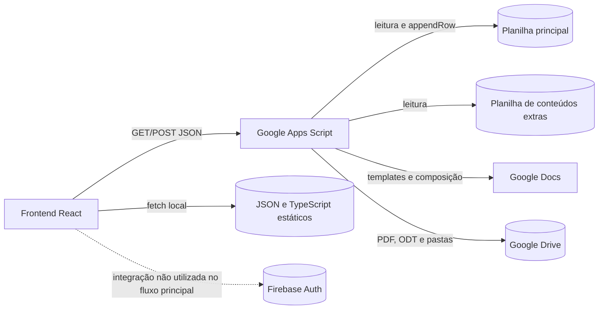
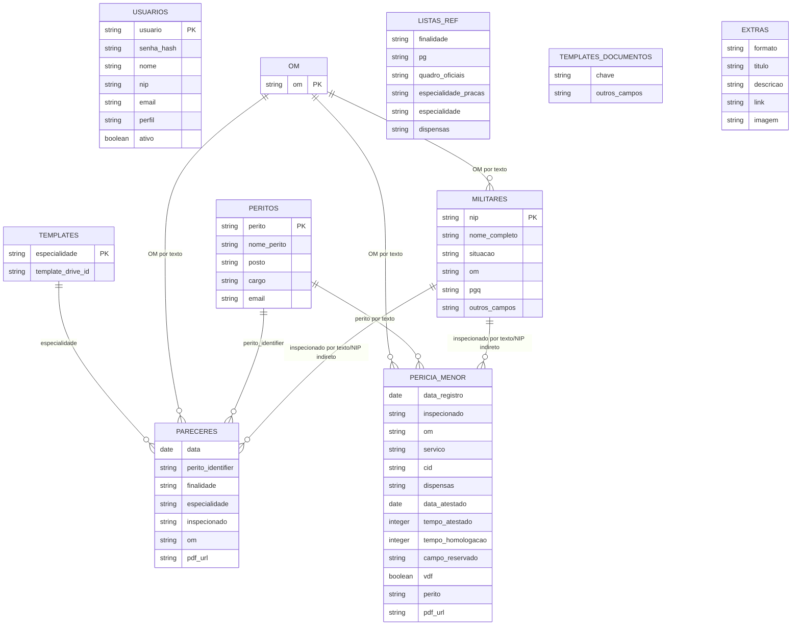
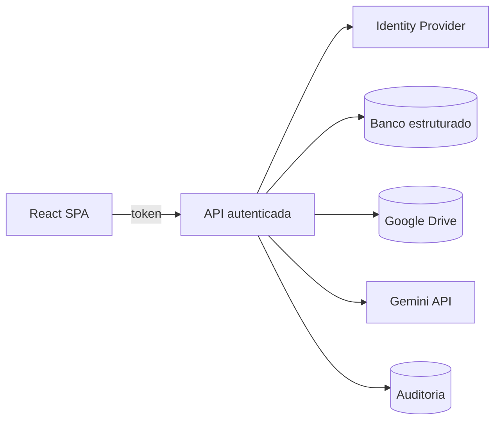
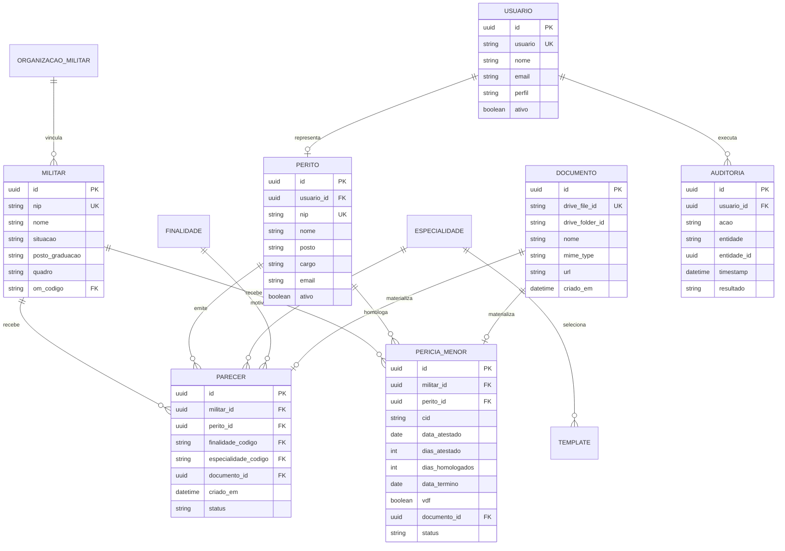

# Banco de Dados

## 1. Visão geral

O **Guia Médico Naval — JRS/HNRe** não utiliza um sistema gerenciador de banco de dados tradicional. A persistência operacional está distribuída entre:

1. **Google Sheets**, usado como banco de dados tabular principal;
2. **Google Drive**, usado como repositório de documentos gerados;
3. **Google Docs**, usado como mecanismo temporário de composição de documentos;
4. **arquivos JSON estáticos**, usados para catálogos de consulta no frontend;
5. **conteúdo TypeScript estático**, usado para dados médico-normativos incorporados ao bundle;
6. **Firebase Authentication**, presente no código, mas não utilizado como fonte principal de usuários no fluxo atual.

A camada de acesso e manipulação dos dados está concentrada no arquivo `Code.gs`, executado como Web App do Google Apps Script. Cada aba de uma planilha funciona como uma tabela lógica, mas não há chaves estrangeiras, restrições de unicidade, transações ou migrações formais.

> **Constatação:** o sistema adota uma arquitetura de persistência baseada em planilhas, adequada a volume reduzido e administração manual, mas com limitações importantes de integridade, concorrência, segurança e evolução do esquema.

---

## 2. Diagrama geral de persistência



---

## 3. Fontes de dados

| Fonte | Tipo | Finalidade | Escrita | Autoridade atual |
|---|---|---|---:|---|
| Planilha principal | Google Sheets | Usuários, militares, listas de referência, peritos, templates, pareceres e perícias menores | Sim | Principal fonte operacional |
| Planilha de extras | Google Sheets | Vídeos, aulas e infográficos | Não pelo app | Fonte editorial externa |
| Google Drive | Armazenamento documental | PDFs, ODTs, imagens incorporadas e minutas | Sim | Fonte dos artefatos finais |
| Google Docs | Documento intermediário | Preenchimento de templates e geração de arquivos | Sim | Temporária durante a geração |
| `public/cid.json` | JSON estático | Catálogo CID utilizado pelo frontend | Não em runtime | Fonte local de consulta |
| `public/servicosHNRe.json` | JSON estático | Catálogo de serviços do HNRe | Não em runtime | Fonte local de consulta |
| `constants.ts` e componentes | TypeScript | Conteúdo normativo, doenças, leis e textos de referência | Não em runtime | Fonte versionada no Git |
| Firebase Authentication | Serviço externo | Login Google e token de leitura do Drive | Potencial | Não integrado ao login principal observado |

---

## 4. Identificadores e configuração

O backend define diretamente no código os identificadores dos principais recursos:

```javascript
const SPREADSHEET_ID = "<id-da-planilha-principal>";
const EXTRAS_SPREADSHEET_ID = "<id-da-planilha-de-extras>";
const DRIVE_FOLDER_ID = "<id-da-pasta-principal>";
```

Também existem IDs de pastas e templates definidos em blocos específicos do `Code.gs`.

### Avaliação

- Os IDs não são segredos criptográficos, mas são detalhes de infraestrutura.
- Mantê-los no código aumenta o acoplamento entre aplicação e ambiente.
- A troca de planilha, pasta ou template exige alteração e nova implantação do script.
- Ambientes de desenvolvimento, homologação e produção não estão isolados.

### Recomendação

Mover identificadores de infraestrutura para `PropertiesService.getScriptProperties()`:

```javascript
const properties = PropertiesService.getScriptProperties();

const SPREADSHEET_ID = properties.getProperty('SPREADSHEET_ID');
const EXTRAS_SPREADSHEET_ID = properties.getProperty('EXTRAS_SPREADSHEET_ID');
const DRIVE_FOLDER_ID = properties.getProperty('DRIVE_FOLDER_ID');
```

---

## 5. Modelo lógico observado



> **Importante:** as relações do diagrama são conceituais. O Google Sheets não implementa essas relações como chaves estrangeiras. Os vínculos são resolvidos por comparação textual e posição de coluna.

---

## 6. Planilha principal

A planilha principal é aberta pelo backend com `SpreadsheetApp.openById(SPREADSHEET_ID)`. Foram identificadas as seguintes abas:

- `ListasRef`;
- `OM`;
- `Perito`;
- `Militares`;
- `Templates_Documentos`;
- `Templates`;
- `Pareceres`;
- `Pericia_Menor`;
- `Usuarios`.

Não foi localizado no repositório um arquivo de definição formal do esquema da planilha. Portanto, parte da estrutura abaixo é derivada diretamente dos índices e cabeçalhos utilizados em `Code.gs`.

---

## 7. Aba `Usuarios`

### 7.1 Finalidade

Armazena as credenciais e os perfis usados pelo fluxo principal de autenticação da aplicação.

### 7.2 Esquema observado

| Ordem | Coluna | Tipo lógico | Obrigatório | Descrição |
|---:|---|---|---:|---|
| 1 | `usuario` | string | Sim | Identificador de login; criado em caixa alta e comparado sem distinção de caixa |
| 2 | `senha_hash` | string | Sim | Hash calculado no frontend e enviado ao backend |
| 3 | `nome` | string | Sim | Nome de exibição do usuário |
| 4 | `nip` | string | Não | NIP associado ao usuário |
| 5 | `email` | string | Não | Endereço eletrônico |
| 6 | `perfil` | enum string | Sim | Perfil de acesso; criação padrão usa `user` |
| 7 | `ativo` | boolean | Sim | Controla se o login é permitido |

Cabeçalho criado automaticamente pelo backend, caso a aba não exista:

```text
usuario | senha_hash | nome | nip | email | perfil | ativo
```

### 7.3 Operações

| Operação | Endpoint | Comportamento |
|---|---|---|
| Autenticar | `GET ?action=login` | Varre todas as linhas e compara usuário, hash e status ativo |
| Listar usuários ativos | `GET ?action=getUsuarios` | Retorna apenas o valor da coluna `usuario` |
| Criar usuário | `GET ?action=createUsuario` | Verifica duplicidade por nome de usuário e usa `appendRow` |

### 7.4 Regras observadas

- `usuario` é normalizado para caixa alta na criação.
- No login, `usuario` é comparado em caixa baixa.
- Um usuário só autentica quando `ativo` for `true`, `TRUE` ou `VERDADEIRO`.
- Novos usuários recebem `perfil = 'user'` e `ativo = true`.
- Não existe ID interno independente do nome de usuário.
- Não foi observada rotina para editar, desativar ou excluir usuários.

### 7.5 Riscos

1. O login e a criação de usuário são executados por `GET`, expondo parâmetros em histórico, logs e URLs.
2. O backend aceita o hash fornecido pelo cliente sem autenticação prévia.
3. Não há *salt* individual identificado na persistência.
4. Não há controle de tentativas, bloqueio temporal ou auditoria.
5. O endpoint de listagem expõe todos os nomes de usuários ativos.
6. O perfil do solicitante não é validado pelo backend para criação de novas contas.
7. Não há sessão ou token assinado no backend; o controle de acesso subsequente fica majoritariamente no frontend.

### 7.6 Modelo recomendado

```text
usuarios
- id: UUID
- usuario: string UNIQUE
- senha_hash: string
- senha_salt: string
- nome: string
- nip: string NULL
- email: string NULL
- perfil: enum('user', 'admin')
- ativo: boolean
- criado_em: timestamp
- atualizado_em: timestamp
- ultimo_login_em: timestamp NULL
```

No curto prazo, recomenda-se substituir esse mecanismo pelo Firebase Authentication já presente no repositório ou por autenticação institucional baseada em Google Workspace.

---

## 8. Aba `Militares`

### 8.1 Finalidade

Funciona como cadastro mestre dos militares utilizados nos formulários de pareceres e perícias menores.

### 8.2 Campos confirmados

O código procura os cabeçalhos pelo nome, portanto a ordem física pode variar para parte das operações.

| Coluna | Tipo lógico | Uso |
|---|---|---|
| `SITUAÇÃO` | string | Situação funcional do militar |
| `OM` | string | Organização Militar |
| `P/G/Q` | string | Posto, graduação ou quadro consolidado |
| `NIP` | string | Identificador utilizado para busca |
| `NOME_COMPLETO` | string | Nome completo do militar |

> **Estimativa:** a aba possui outras colunas, pois `getMilitar` devolve dinamicamente todos os cabeçalhos da linha encontrada. Esses campos adicionais não podem ser enumerados com segurança apenas pelo código-fonte.

### 8.3 Operações

#### Listagem resumida

`GET ?action=getMilitaresList` retorna:

```json
[
  {
    "nome": "NOME COMPLETO",
    "nip": "00000000"
  }
]
```

A operação exige que os cabeçalhos `NIP` e `NOME_COMPLETO` existam.

#### Consulta individual

`GET ?action=getMilitar&nip=...`:

- remove caracteres não numéricos do NIP informado;
- remove caracteres não numéricos do valor armazenado;
- compara os dois valores;
- retorna um objeto cujas chaves são todos os cabeçalhos da planilha.

#### Inclusão automática

Quando um POST contém `isNewMilitar = true`, o backend cria uma nova linha e preenche apenas os campos conhecidos:

```text
SITUAÇÃO
OM
P/G/Q
NIP
NOME_COMPLETO
```

As demais colunas ficam vazias.

### 8.4 Chave lógica

`NIP` atua como chave natural, mas:

- não existe restrição formal de unicidade;
- a inclusão de novo militar não verifica duplicidade;
- diferentes formatos são normalizados apenas na consulta;
- células numéricas podem perder zeros à esquerda se a coluna não estiver formatada como texto.

### 8.5 Recomendações

- formatar `NIP` como texto;
- validar unicidade antes de `appendRow`;
- adicionar `militar_id` imutável;
- registrar datas de criação e atualização;
- manter campos atômicos separados para posto, graduação, quadro e especialidade;
- evitar o campo composto `P/G/Q` como único dado estrutural.

---

## 9. Aba `ListasRef`

### 9.1 Finalidade

Centraliza listas utilizadas para preenchimento de selects e formulários.

### 9.2 Colunas observadas

| Coluna | Conteúdo |
|---|---|
| `FINALIDADE` | Finalidades de inspeção de saúde |
| `P/G` | Postos e graduações |
| `QUADRO_OFICIAIS` | Quadros de oficiais |
| `ESPECIALIDADE_PRACAS` | Especialidades de praças |
| `ESPECIALIDADE` | Especialidades médicas ou periciais |
| `DISPENSAS` | Tipos de dispensa ou restrição |

### 9.3 Estrutura

Cada coluna funciona como uma lista independente. O backend ignora células vazias e devolve todos os valores não vazios abaixo do cabeçalho.

```json
{
  "FINALIDADES": [],
  "PG": [],
  "QUADRO_OFICIAIS": [],
  "ESPECIALIDADE_PRACAS": [],
  "ESPECIALIDADES": [],
  "DISPENSAS": []
}
```

### 9.4 Limitações

- não há ID, código ou status ativo;
- a ordem das linhas determina a ordem visual;
- não há prevenção de duplicatas;
- listas com comprimentos diferentes compartilham linhas sem relação semântica;
- renomear um cabeçalho quebra silenciosamente a respectiva lista, que passa a retornar vazia.

### 9.5 Evolução sugerida

Separar em uma aba normalizada, por exemplo:

| `tipo` | `codigo` | `rotulo` | `ordem` | `ativo` |
|---|---|---|---:|---:|
| `FINALIDADE` | `FIS_001` | `...` | 10 | TRUE |
| `DISPENSA` | `DISP_001` | `...` | 20 | TRUE |

---

## 10. Aba `OM`

### 10.1 Finalidade

Catálogo de Organizações Militares.

### 10.2 Esquema observado

| Coluna | Tipo lógico | Regra |
|---|---|---|
| `OM` | string | Todos os valores não vazios são retornados |

### 10.3 Uso

A lista é agregada à resposta de `getLookups` sob a chave `OM`.

### 10.4 Recomendações

Acrescentar:

- código estável da OM;
- nome por extenso;
- sigla;
- status ativo;
- ordem de exibição;
- comando ou região, caso necessário.

---

## 11. Aba `Perito`

### 11.1 Finalidade

Cadastro dos peritos disponíveis para seleção e preenchimento de documentos.

### 11.2 Esquema observado por posição

| Índice | Campo retornado | Tipo lógico |
|---:|---|---|
| 0 | `PERITO` | string |
| 1 | `NOME_PERITO` | string |
| 2 | `POSTO` | string |
| 3 | `CARGO` | string |
| 4 | `EMAIL` | string |

O backend inclui apenas linhas cuja primeira coluna esteja preenchida.

### 11.3 Riscos

- a leitura depende da posição, não dos nomes dos cabeçalhos;
- inserir ou mover uma coluna altera o significado dos dados;
- `PERITO` é usado como identificador textual;
- a seleção do template de perícia menor é feita por busca de nomes específicos dentro do texto do perito;
- não há vínculo explícito entre perito e usuário autenticado.

### 11.4 Modelo recomendado

```text
peritos
- id: UUID
- usuario_id: UUID NULL
- nip: string
- nome: string
- nome_exibicao: string
- posto: string
- cargo: string
- email: string
- template_pericia_menor_id: string NULL
- ativo: boolean
```

---

## 12. Aba `Templates`

### 12.1 Finalidade

Mapeia cada especialidade a um template de Google Docs utilizado para gerar pareceres regulares.

### 12.2 Esquema observado por posição

| Índice | Tipo lógico | Descrição |
|---:|---|---|
| 0 | string | Especialidade |
| 1 | string | ID do arquivo de template no Google Drive |

### 12.3 Consulta

O backend percorre a planilha e procura correspondência exata:

```javascript
if (templatesData[i][0] === payload.especialidade) {
  templateId = templatesData[i][1];
}
```

### 12.4 Implicações

- diferenças de caixa, espaços ou acentos impedem a localização;
- não existe template padrão;
- não há validação do tipo ou da existência do arquivo antes da operação completa;
- não há versionamento ou status do template;
- o ID do Drive é tratado como dado de configuração.

### 12.5 Modelo recomendado

| `template_id` | `tipo` | `especialidade_codigo` | `drive_file_id` | `versao` | `ativo` |
|---|---|---|---|---:|---:|

---

## 13. Aba `Templates_Documentos`

### 13.1 Finalidade

Fornece ao frontend uma lista dinâmica de documentos-modelo apresentada pelo módulo de templates.

### 13.2 Estrutura observada

O backend lê a primeira linha como cabeçalho e converte cada linha em objeto genérico:

```javascript
headers.forEach((header, column) => {
  template[header] = row[column];
});
```

Apenas linhas com a primeira coluna preenchida são incluídas.

### 13.3 Consequência

O contrato depende integralmente dos cabeçalhos presentes na planilha. Como o código do backend não fixa os nomes, o esquema exato deve ser confirmado na planilha.

> **Estimativa:** a aba contém metadados como título, descrição, categoria, link e/ou imagem, mas esses campos não podem ser declarados como fatos sem acesso ao conteúdo da planilha.

### 13.4 Observação de integração

O componente `TemplatesGuide.tsx` consulta uma URL de Google Apps Script diferente da URL usada nos demais módulos. Isso pode indicar:

- implantação antiga;
- backend separado;
- versão desatualizada do endpoint;
- dependência não documentada.

Recomenda-se centralizar a URL da API e confirmar qual implantação é a fonte oficial dessa aba.

---

## 14. Aba `Pareceres`

### 14.1 Finalidade

Registra os pareceres especializados gerados pelo sistema e disponibiliza seu histórico.

### 14.2 Esquema observado por posição

| Índice | Coluna lógica | Tipo | Origem |
|---:|---|---|---|
| 0 | `DATA` | date/string | Data de geração |
| 1 | `PERITO_IDENTIFIER` | string | Identificador do perito enviado pelo frontend |
| 2 | `FINALIDADE` | string | Finalidade da IS |
| 3 | `ESPECIALIDADE` | string | Especialidade do parecer |
| 4 | `INSPECIONADO` | string | Nome do inspecionado |
| 5 | `OM` | string | Organização Militar |
| 6 | `LINK` | URL string | URL do PDF gerado |

### 14.3 Escrita

Após criar o documento, o backend executa:

```javascript
pareceresSheet.appendRow([
  shortDate,
  payload.peritoIdentifier,
  payload.finalidade,
  payload.especialidade,
  payload.inspecionado,
  payload.om,
  pdfFile.getUrl(),
]);
```

### 14.4 Leitura

`GET ?action=getPareceresList` retorna apenas:

```json
{
  "data": "DD/MM/AAAA",
  "especialidade": "...",
  "inspecionado": "...",
  "link": "https://..."
}
```

A listagem:

- considera apenas linhas com a coluna de inspecionado preenchida;
- formata valores `Date` como `DD/MM/AAAA`;
- converte os campos para string;
- inverte a ordem para apresentar registros mais recentes primeiro, assumindo inserção cronológica.

### 14.5 Problemas de integridade

- não existe `parecer_id`;
- o inspecionado é salvo apenas pelo nome, sem NIP;
- o perito é salvo por identificador textual;
- o link aponta diretamente para o Drive, mas o ID do arquivo não é armazenado separadamente;
- a data não inclui hora;
- não existe status, versão, exclusão lógica ou trilha de auditoria;
- um arquivo removido do Drive gera registro órfão;
- uma linha removida não apaga o arquivo correspondente.

### 14.6 Modelo recomendado

```text
pareceres
- id: UUID
- militar_id: UUID
- perito_id: UUID
- finalidade_codigo: string
- especialidade_codigo: string
- om_codigo: string
- documento_drive_id: string
- pdf_url: string
- status: enum
- criado_em: timestamp
- criado_por: UUID
- atualizado_em: timestamp
```

---

## 15. Aba `Pericia_Menor`

### 15.1 Finalidade

Registra as perícias menores geradas a partir de atestados médicos e permite classificar registros vigentes, concluídos e encaminhados para VDF.

### 15.2 Esquema observado por posição

| Índice | Coluna lógica | Tipo | Observação |
|---:|---|---|---|
| 0 | `DATA_REGISTRO` | date/string | Salva em `YYYY-MM-DD` |
| 1 | `INSPECIONADO` | string | Nome do militar |
| 2 | `OM` | string | Organização Militar |
| 3 | `SERVICO` | string | Serviço associado |
| 4 | `CID` | string | Código CID principal |
| 5 | `DISPENSAS` | string | Dispensa ou restrição |
| 6 | `DATA_ATESTADO` | date/string | Data inicial do afastamento |
| 7 | `TEMPO_ATESTADO` | integer/string | Dias indicados no atestado |
| 8 | `TEMPO_HOMOLOGACAO` | integer/string | Dias homologados |
| 9 | campo não utilizado | string | Inserido como vazio |
| 10 | `VDF` | boolean | Encaminhamento para VDF |
| 11 | `PERITO` | string | Perito selecionado |
| 12 | `LINK` | URL string | PDF gerado |

> **Estimativa:** o nome do campo de índice 9 não pode ser confirmado pelo código. Ele é sempre gravado como string vazia e não é usado na leitura.

### 15.3 Escrita

O backend utiliza `appendRow`, após gerar o PDF:

```javascript
periciaSheet.appendRow([
  shortDate,
  payload.inspecionado,
  payload.om,
  payload.servico,
  payload.cid,
  payload.dispensas,
  payload.dataAtestado,
  payload.tempoAtestado,
  payload.tempoHomolog,
  "",
  payload.vdf,
  payload.perito,
  pdfFile.getUrl()
]);
```

### 15.4 Campos calculados na leitura

Os campos `vigente` e `concluido` não são persistidos. São derivados a cada requisição:

```text
DATA_TERMINO = DATA_ATESTADO + TEMPO_HOMOLOGACAO - 1 dia
```

Regras:

- a contagem considera o dia do atestado como D1;
- `vigente = DATA_TERMINO >= hoje`;
- `concluido = DATA_TERMINO < hoje`;
- o horário é zerado para comparação por data civil.

### 15.5 Conversão de data

O backend tenta interpretar `DATA_ATESTADO` em três formatos:

1. objeto `Date` do Apps Script;
2. número serial de planilha;
3. string interpretável por `new Date()`.

A resposta expõe:

- `dataAtestado` em `DD/MM/AAAA`;
- `dataAtestadoTs` como timestamp em milissegundos;
- `tempoAtestado` e `tempoHomolog` como strings;
- `vigente` e `concluido` como booleanos.

### 15.6 Contrato de resposta

```json
{
  "inspecionado": "...",
  "om": "...",
  "cid": "M54.5",
  "dispensas": "...",
  "dataAtestado": "26/07/2026",
  "dataAtestadoTs": 1785034800000,
  "tempoAtestado": "5",
  "tempoHomolog": "3",
  "vigente": true,
  "concluido": false,
  "vdf": false,
  "link": "https://drive.google.com/..."
}
```

### 15.7 Riscos

- ausência de ID e NIP do inspecionado;
- datas armazenadas em formatos potencialmente mistos;
- cálculo dependente do fuso horário do script;
- valores numéricos devolvidos como string;
- registros classificados apenas no momento da leitura;
- o status não distingue cancelamento, revisão ou exclusão;
- links e documentos podem divergir da linha da planilha;
- não há validação de que `tempoHomolog <= tempoAtestado`;
- não há restrição de CID, OM, serviço ou dispensa contra os catálogos.

### 15.8 Modelo recomendado

```text
pericias_menores
- id: UUID
- militar_id: UUID
- om_codigo: string
- servico_codigo: string
- cid_codigo: string
- dispensa_codigo: string
- data_atestado: date
- dias_atestado: integer
- dias_homologados: integer
- data_termino: date
- encaminhar_vdf: boolean
- perito_id: UUID
- documento_drive_id: string
- pdf_url: string
- status: enum('vigente', 'concluida', 'cancelada', 'revisada')
- criado_em: timestamp
- criado_por: UUID
```

---

## 16. Planilha de conteúdos extras

### 16.1 Finalidade

A planilha identificada por `EXTRAS_SPREADSHEET_ID` armazena conteúdos complementares exibidos como vídeos, aulas e infográficos.

O backend utiliza sempre a primeira aba da planilha:

```javascript
const sheet = ss.getSheets()[0];
```

### 16.2 Esquema observado

| Coluna | Tipo lógico | Fallback posicional |
|---|---|---:|
| `FORMATO` | string | 0 |
| `TITULO` | string | 1 |
| `DESCRICAO` | string | 2 |
| `LINK` | URL/string | 3 |
| `IMAGEM` | URL/string | 4 |

Caso um cabeçalho não seja encontrado, o backend usa a posição fixa correspondente.

### 16.3 Contrato de resposta

```json
{
  "format": "Vídeos",
  "title": "...",
  "description": "...",
  "link": "https://...",
  "imageUrl": "https://..."
}
```

O frontend posteriormente:

- normaliza `FORMATO` para `Aulas`, `Vídeos` ou `Infográficos`;
- extrai o ID do YouTube;
- transforma links do Canva em URLs de visualização e incorporação;
- cria um ID efêmero com base no índice da resposta: `extra-${idx}`.

### 16.4 Limitações

- não há ID persistente;
- reordenar linhas altera os IDs usados no frontend;
- a primeira aba é assumida implicitamente;
- não existe status de publicação;
- não existe ordenação explícita;
- links e formatos não são validados no backend;
- o conteúdo pode depender de URLs públicas externas.

### 16.5 Esquema recomendado

| Campo | Tipo |
|---|---|
| `id` | UUID/string estável |
| `formato` | enum |
| `titulo` | string |
| `descricao` | text |
| `link` | URL |
| `imagem_url` | URL nullable |
| `ordem` | integer |
| `ativo` | boolean |
| `publicado_em` | timestamp nullable |

---

## 17. Arquivos JSON estáticos

### 17.1 `public/cid.json`

Arquivo de grande volume disponibilizado diretamente com o frontend. É usado como catálogo de códigos CID.

Características:

- carregado pelo navegador;
- versionado com o repositório;
- não depende do Google Apps Script;
- atualizado apenas mediante alteração, commit e novo deploy;
- aumenta o volume transferido ao cliente quando carregado integralmente.

### 17.2 `public/servicosHNRe.json`

Catálogo de serviços do Hospital Naval de Recife utilizado no formulário de perícia menor.

Características equivalentes:

- fonte estática;
- sem edição administrativa em runtime;
- sem versionamento semântico do conteúdo;
- potencial divergência em relação aos dados operacionais mantidos em planilhas.

### 17.3 Recomendações

- documentar a origem e a data de atualização;
- acrescentar um campo de versão no arquivo;
- validar o JSON no pipeline de CI;
- gerar índices simplificados para busca;
- considerar carregamento sob demanda para catálogos volumosos;
- definir uma única fonte de verdade para serviços e especialidades.

Exemplo de envelope versionado:

```json
{
  "schemaVersion": 1,
  "updatedAt": "2026-07-26",
  "source": "fonte oficial",
  "items": []
}
```

---

## 18. Dados estáticos em TypeScript

Parte significativa do conteúdo normativo e médico-pericial está codificada em:

- `constants.ts`;
- componentes de guia;
- componentes de artigos;
- páginas de resumo da DGPM;
- componentes especializados de doenças.

Esses dados são persistidos no Git, não em banco operacional.

### Vantagens

- versionamento por commit;
- funcionamento sem chamada ao backend;
- implantação simples;
- revisão por *pull request*.

### Limitações

- conteúdo e apresentação ficam acoplados;
- alterações editoriais exigem desenvolvimento e novo deploy;
- duplicação e inconsistência são difíceis de detectar;
- não há busca central ou gestão de versões do conteúdo;
- não há metadados editoriais padronizados.

### Evolução sugerida

Migrar progressivamente o conteúdo para Markdown ou JSON estruturado no próprio repositório:

```text
content/
├── doencas/
├── legislacao/
├── artigos/
├── resumos-dgpm/
└── manifest.json
```

Isso mantém o versionamento Git sem misturar conteúdo e componentes React.

---

## 19. Google Drive como armazenamento documental

### 19.1 Tipos de artefato

O backend cria ou manipula:

- Google Docs temporários;
- PDFs de perícia menor;
- PDFs de pareceres;
- arquivos ODT de pareceres;
- minutas em Google Docs;
- imagens de atestados incorporadas ao documento.

### 19.2 Organização observada

Para pareceres e perícias menores, o backend:

1. abre uma pasta pai por ID;
2. procura uma subpasta cujo título seja exatamente o nome do inspecionado;
3. reutiliza a primeira pasta encontrada ou cria uma nova;
4. copia o template para a subpasta;
5. preenche os marcadores;
6. exporta o documento;
7. move o Google Doc intermediário para a lixeira;
8. registra a URL do PDF na planilha.

### 19.3 Problemas potenciais

- homônimos compartilham a mesma pasta;
- mudança de nome pode gerar nova pasta para a mesma pessoa;
- caracteres especiais podem afetar a consulta da pasta;
- a pesquisa por título não garante unicidade;
- a planilha armazena URL, e não o ID canônico do arquivo;
- não existe rotina de reconciliação entre planilha e Drive;
- ODTs de pareceres são gerados em memória, mas a persistência final deve ser confirmada no fluxo completo;
- documentos temporários na lixeira permanecem sujeitos à política de retenção do Drive.

### 19.4 Convenção recomendada

Usar o NIP ou UUID na pasta e manter o nome apenas como rótulo:

```text
/Pareceres/
  /<militar-id> - <nome-normalizado>/
    /2026/
      parecer-<parecer-id>.pdf
      parecer-<parecer-id>.odt
```

Persistir na base:

- `drive_file_id`;
- `drive_folder_id`;
- nome do arquivo;
- MIME type;
- checksum opcional;
- data de criação;
- status de retenção.

---

## 20. Contratos da API relacionados a dados

### 20.1 Operações GET

| Ação | Fonte | Retorno principal |
|---|---|---|
| `getLookups` | `ListasRef`, `OM`, `Perito` | Listas de referência |
| `getMilitaresList` | `Militares` | Nome e NIP |
| `getMilitar` | `Militares` | Registro completo por NIP |
| `getTemplatesDocumentos` | `Templates_Documentos` | Objetos dinâmicos por cabeçalho |
| `getPareceresList` | `Pareceres` | Histórico resumido |
| `getPericiaMenorList` | `Pericia_Menor` | Histórico com status calculado |
| `getExtras` | planilha de extras | Conteúdos complementares |
| `login` | `Usuarios` | Nome e perfil |
| `getUsuarios` | `Usuarios` | Usuários ativos |
| `createUsuario` | `Usuarios` | Criação de conta |

### 20.2 Operações POST

| Ação/condição | Dados afetados |
|---|---|
| `extrair_dados_atestado` | Não persiste; retorna JSON extraído pelo Gemini |
| `gerar_minuta_is` ou fluxo equivalente | Cria Google Doc no Drive |
| `isNewMilitar = true` | Acrescenta linha em `Militares` |
| `gerar_pericia_menor` | Cria PDF e acrescenta linha em `Pericia_Menor` |
| POST sem `action`, com `especialidade` | Cria parecer e acrescenta linha em `Pareceres` |
| `imprimir` | Acessa PDF existente; persistência adicional depende do fluxo completo |

### 20.3 Envelope de resposta

O padrão dominante é:

```json
{
  "success": true,
  "data": {}
}
```

ou, em caso de erro:

```json
{
  "success": false,
  "message": "Descrição do erro"
}
```

Há inconsistência entre `message` e `error` nos endpoints de autenticação.

### Recomendação

Padronizar:

```json
{
  "ok": false,
  "error": {
    "code": "USER_NOT_FOUND",
    "message": "Usuário não encontrado",
    "details": null
  }
}
```

---

## 21. Integridade e validação

### 21.1 Situação atual

A maior parte das regras está implementada em código imperativo e depende de:

- cabeçalhos com grafia exata;
- índices fixos de coluna;
- igualdade textual;
- valores booleanos em múltiplos formatos;
- planilhas sem linhas ou colunas deslocadas;
- listas controladas manualmente.

Não foram identificados:

- validadores formais de esquema;
- restrições de unicidade;
- chaves estrangeiras;
- transações;
- controle de versão do esquema;
- trilha de auditoria;
- exclusão lógica;
- rotina de backup no código;
- testes automatizados do acesso a dados.

### 21.2 Validações mínimas recomendadas

#### Usuários

- `usuario` obrigatório e único;
- `perfil` limitado a valores conhecidos;
- `email` validado;
- `nip` normalizado;
- senha processada apenas no backend ou por provedor de identidade.

#### Militares

- NIP obrigatório, texto e único;
- nome obrigatório;
- OM validada contra catálogo;
- normalização de caixa e espaços.

#### Pareceres

- militar e perito identificados por ID;
- finalidade e especialidade validadas;
- documento confirmado antes da gravação;
- timestamp completo.

#### Perícia menor

- CID normalizado;
- datas ISO;
- números inteiros positivos;
- `dias_homologados <= dias_atestado`, salvo regra formal em contrário;
- perito e militar existentes;
- URL/ID do arquivo confirmado.

---

## 22. Concorrência e consistência

### 22.1 Risco atual

`appendRow` é simples, mas múltiplos usuários podem gravar simultaneamente. Além disso, a criação de documentos e a gravação na planilha não constituem uma transação única.

Cenários possíveis:

1. o PDF é criado e a gravação na planilha falha;
2. a linha é criada após uma tentativa repetida, gerando duplicidade;
3. duas requisições criam subpastas homônimas simultaneamente;
4. dois cadastros inserem o mesmo usuário ou NIP entre a verificação e o `appendRow`;
5. uma requisição expira depois de criar parte dos recursos.

### 22.2 Mitigação no Apps Script

Utilizar `LockService` nas seções críticas:

```javascript
const lock = LockService.getScriptLock();
lock.waitLock(30000);

try {
  // verificar duplicidade e gravar
} finally {
  lock.releaseLock();
}
```

Adicionar uma chave idempotente por operação:

```text
request_id: UUID gerado no frontend
```

Antes de gerar um novo documento, o backend deve verificar se o `request_id` já foi processado.

---

## 23. Segurança e privacidade dos dados

O sistema trata informações pessoais e potencialmente sensíveis, incluindo:

- nome e NIP de militares;
- OM e situação funcional;
- informações de saúde;
- CID;
- atestados médicos em imagem;
- períodos de afastamento;
- pareceres e documentos médico-periciais;
- dados de usuários e credenciais.

### 23.1 Riscos observados

- autenticação sem token de sessão backend;
- endpoints sensíveis acessíveis pela URL pública do Apps Script;
- criação de usuário por GET;
- hashes em parâmetros de URL;
- autorização orientada pelo frontend;
- links de Drive armazenados diretamente;
- ausência de auditoria de leitura e escrita;
- dados médicos enviados ao Gemini por API;
- IDs de infraestrutura incorporados ao código;
- mensagens de erro podem expor detalhes internos.

### 23.2 Controles recomendados

- autenticação via Google Workspace/Firebase Auth;
- validação do token no backend;
- autorização por perfil em cada endpoint;
- princípio do menor privilégio nas pastas do Drive;
- restrição do Web App ao domínio institucional, quando aplicável;
- logs de acesso e alterações;
- política de retenção e descarte de documentos;
- minimização de dados enviados à IA;
- revisão de conformidade com LGPD e normas internas;
- não incluir dados sensíveis em logs;
- criptografia em trânsito e controles nativos do Google Workspace;
- anonimização ou pseudonimização quando possível.

> **Recomendação crítica:** o controle de visibilidade no frontend não deve ser considerado mecanismo de autorização. Toda operação de consulta ou gravação sensível precisa validar a identidade e o perfil no backend.

---

## 24. Backup, retenção e recuperação

Não foram identificadas rotinas automatizadas de backup ou restauração no repositório.

### Plano mínimo recomendado

1. **Planilhas**
   - exportação diária para XLSX ou CSV;
   - cópia versionada em pasta restrita;
   - retenção definida por política institucional.

2. **Drive**
   - evitar exclusão definitiva automática;
   - utilizar lixeira e retenção administrativa;
   - copiar artefatos críticos para pasta de arquivo imutável.

3. **Configuração**
   - documentar IDs e propriedades do script fora do código;
   - registrar o proprietário dos recursos;
   - manter inventário de templates e versões.

4. **Teste de restauração**
   - validar periodicamente a recuperação da planilha e dos documentos;
   - não considerar backup válido sem teste de restauração.

---

## 25. Observabilidade e auditoria

### Situação atual

Erros são capturados e devolvidos como texto JSON. O Google Apps Script mantém logs de execução, mas não há modelo de auditoria de domínio.

### Tabela lógica sugerida: `Auditoria`

| Campo | Tipo | Descrição |
|---|---|---|
| `evento_id` | UUID | Identificador único |
| `timestamp` | datetime | Momento da ação |
| `usuario_id` | string | Autor autenticado |
| `acao` | string | Ex.: `PERICIA_CRIADA` |
| `entidade` | string | Ex.: `Pericia_Menor` |
| `entidade_id` | string | ID do registro |
| `resultado` | enum | sucesso ou falha |
| `request_id` | UUID | Correlação/idempotência |
| `detalhes` | JSON/string | Metadados sem dados clínicos desnecessários |

Eventos prioritários:

- login bem-sucedido ou negado;
- criação e alteração de usuário;
- inclusão de militar;
- geração de parecer;
- geração de perícia menor;
- uso da extração por IA;
- falha na criação ou exportação de documento;
- abertura ou impressão de documento, quando tecnicamente aplicável.

---

## 26. Convenções de dados recomendadas

### 26.1 Identificadores

- usar UUID para registros internos;
- não usar nome como chave;
- manter NIP como chave natural única, não como chave primária técnica;
- armazenar IDs de arquivos do Drive separadamente das URLs.

### 26.2 Datas e horas

- persistir datas civis como `YYYY-MM-DD`;
- persistir eventos como timestamp ISO 8601;
- definir explicitamente `America/Recife` ou `America/Sao_Paulo`, conforme o ambiente institucional;
- não depender da interpretação de `new Date(string)` para formatos ambíguos.

### 26.3 Strings

- aplicar `trim`;
- armazenar forma canônica e rótulo de exibição separadamente;
- preservar acentos no rótulo;
- usar códigos estáveis para relações;
- evitar listas separadas por vírgula em uma única célula.

### 26.4 Booleanos

Persistir booleanos reais, não textos como `SIM`, `TRUE` ou `VERDADEIRO`. A apresentação em português deve ocorrer apenas na interface.

### 26.5 Números

- dias como inteiro;
- não converter números em string na API;
- validar faixa e sinal;
- tratar NIP e códigos como texto, mesmo quando compostos apenas por dígitos.

---

## 27. Versionamento do esquema

A planilha atual não possui mecanismo formal de migração.

### Solução mínima para Google Sheets

Criar uma aba `Schema_Metadata`:

| chave | valor |
|---|---|
| `schema_version` | `1` |
| `updated_at` | `2026-07-26T12:00:00-03:00` |
| `updated_by` | `...` |
| `environment` | `production` |

O Apps Script deve validar a versão esperada antes de processar operações críticas.

### Migrações

Manter scripts versionados no repositório:

```text
migrations/
├── 001-create-usuarios.gs
├── 002-add-ids.gs
├── 003-normalize-dates.gs
└── README.md
```

Cada migração deve ser:

- idempotente;
- registrada;
- testada em cópia da planilha;
- acompanhada de backup;
- reversível quando possível.

---

## 28. Estratégia de evolução

### Fase 1 — estabilizar o Google Sheets

- centralizar cabeçalhos em constantes;
- eliminar índices fixos;
- criar IDs imutáveis;
- normalizar datas, booleanos e números;
- usar `LockService`;
- implementar autenticação e autorização no backend;
- criar auditoria;
- centralizar URLs e IDs em propriedades do script;
- adicionar validação de esquema.

### Fase 2 — separar camadas

Dividir o `Code.gs` por responsabilidade:

```text
apps-script/
├── Api.gs
├── AuthService.gs
├── SpreadsheetRepository.gs
├── DriveRepository.gs
├── MilitarService.gs
├── ParecerService.gs
├── PericiaMenorService.gs
├── GeminiService.gs
├── Validation.gs
└── Config.gs
```

### Fase 3 — migrar persistência operacional

Quando o volume, criticidade ou número de usuários justificar, migrar as entidades operacionais para Firestore, Cloud SQL/PostgreSQL ou outra base gerenciada.

Manter o Google Drive como repositório documental, armazenando no banco apenas metadados e IDs.

### Fase 4 — modelo alvo



---

## 29. Modelo relacional alvo sugerido



---

## 30. Checklist para alterações no banco

Antes de alterar uma aba, cabeçalho, coluna ou integração:

- [ ] Foi realizado backup da planilha?
- [ ] A alteração foi testada em uma cópia?
- [ ] O nome exato dos cabeçalhos foi preservado ou o código foi atualizado?
- [ ] Os endpoints que usam índices fixos foram revisados?
- [ ] O tipo da coluna foi configurado corretamente?
- [ ] Datas estão em formato não ambíguo?
- [ ] NIP e códigos estão formatados como texto?
- [ ] Booleanos são valores reais de planilha?
- [ ] Foi definida uma regra de unicidade?
- [ ] Relações usam IDs estáveis em vez de nomes?
- [ ] O frontend continua compatível com o contrato da API?
- [ ] A mudança exige migração dos registros existentes?
- [ ] O número da versão do esquema foi atualizado?
- [ ] A autorização da operação foi validada no backend?
- [ ] Dados sensíveis não foram incluídos em logs?
- [ ] O vínculo entre a linha e o arquivo do Drive permanece íntegro?
- [ ] Houve teste com requisições simultâneas?
- [ ] A documentação foi atualizada?

---

## 31. Resumo das decisões recomendadas

1. **No estado atual**, tratar o Google Sheets como banco operacional de baixa escala e documentar rigorosamente os cabeçalhos.
2. **No curto prazo**, adicionar IDs, validações, bloqueios, auditoria e autenticação backend.
3. **Não usar nomes, especialidades ou URLs como chaves técnicas.**
4. **Persistir IDs do Drive**, mantendo URLs apenas como dados derivados ou conveniência.
5. **Normalizar datas, números e booleanos** antes de ampliar o sistema.
6. **Centralizar catálogos** para evitar divergência entre JSON, TypeScript e planilhas.
7. **Migrar para banco estruturado** quando houver aumento de escala, múltiplos escritores, necessidade de relatórios complexos ou maior exigência de rastreabilidade.
8. **Manter o Drive como repositório documental**, mesmo após eventual migração do banco transacional.
9. **Substituir o login em planilha** por identidade gerenciada e autorização validada no servidor.
10. **Adotar política formal de retenção, backup e conformidade**, devido à natureza médico-pericial dos dados.
